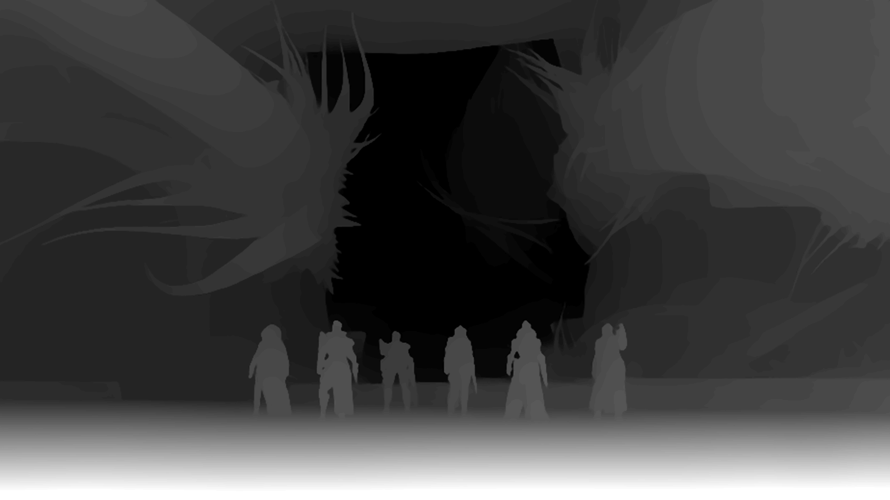
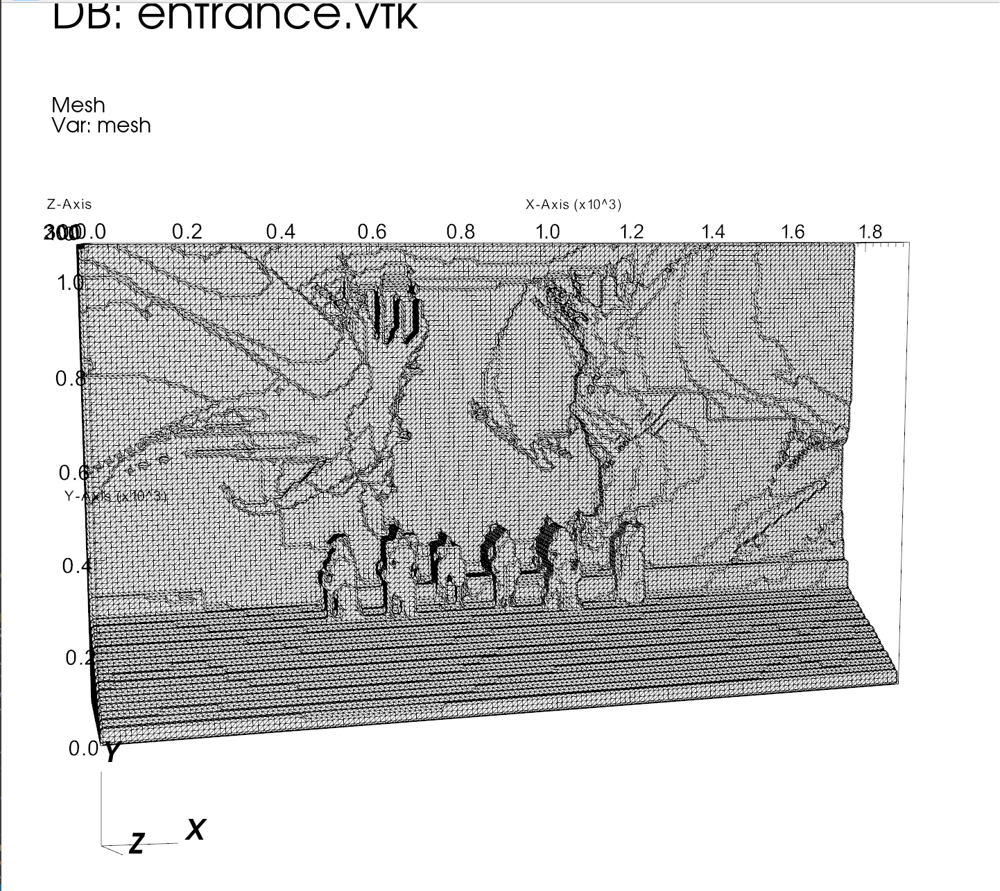
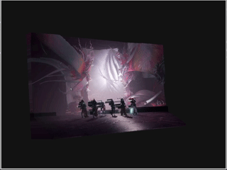

# VisItProject — Image to 3D Relief Mesh

Turn any photo or sketch into a relief-style 3D mesh and view it interactively.

## Quick start

From the repo root:

```bash
./run_all.sh /path/to/your_image.jpg
```

`run_all.sh` handles everything:

1. **Python** - creates `image_pipeline_env/` and installs dependencies if needed
2. **C++** - builds `image_pipeline`, `build_character_mesh`, and `render_mesh` if missing
3. **Pipeline** - generates depth, builds mesh, opens viewer

The first run can take several minutes while pip installs PyTorch and the hugging face depth model.

### Help

```bash
./run_all.sh --help
```

Shows usage plus all pipeline flags.

## Prerequisites (Linux / WSL)

```bash
sudo apt update
sudo apt install -y python3 python3-venv cmake build-essential libvtk9-dev
```

If VTK is not found at the default path:

```bash
export VTK_DIR=/path/to/your/VTKConfig.cmake/dir
```

## Options

```bash
./run_all.sh image.jpg --lineart                        # depth from cleaned line art (sketches)
./run_all.sh image.jpg --lineart --lineart-texture      # use lineart texture instead of original image when viewing
./run_all.sh image.jpg --step 24                        # coarser mesh (fewer polygons)
./run_all.sh image.jpg --no-view                        # build mesh, skip viewer
```

Depth uses the Depth-Anything **Base** model found at https://huggingface.co/depth-anything/Depth-Anything-V2-Base-hf. Mesh settings (`zdim`, relief height, etc.) are fixed defaults.

## Output files

| File | Purpose |
|------|---------|
| `*_depth.png` | Depth map that drives mesh geometry |
| `*.vtk` | Exported 3D mesh |
| `*_oriented.jpg` | EXIF-corrected copy (when the source photo needs rotation) |
| `*_lineart.jpg` | Clean B/W line art (with `--lineart`) |

## How it works

```
image.jpg  -->  depth sidecar  -->  VTK mesh  -->  textured viewer
```

- **Python** (`depth_image_generator.py`) - depth map + optional line-art only
- **C++** (`cpp/`) - mesh build (`build_character_mesh.cpp`) and viewer (`render_mesh.cpp`)
- **Pipeline** (`cpp/image_pipeline.cpp`) - controls running the above three files in succession (seperate binaries for the cpp files)

## Examples

Using `entrance.jpg`:

**Input**


|<br>
v

**Depth sidecar**



|<br>
v

**Mesh**



|<br>
v

**Textured viewer**



## Summary

I ran into a lot of challenges along the way. The biggest challenge I faced during this project, was figuring out the best way to determine the height value at each pixel across any given image. I first tried turning the image to grayscale, and then giving each pixel a height value. This sort of worked, but was giving me results that looked like a nail bed. This is when I took a step back and did some research. I ended up just using an AI depth model from hugging face. When I first tried it, I was amazed with the results so I just stuck with it. Aside from calculating depth, my initial approach was centered around extending visit's image database plugin. I ended up getting it to work (similar to the functionality of build_character_mesh.cpp) but it was a huge pain for me to acually visualize the results. I had to generate the depth image on my machine, then take the depth image and plug it into visit for the database reader to execute, then finally take the resulting vtk and download it back to my machine to visualize it. At this point I had already spent a considerable amount of time getting it to work so I wanted to enhance this idea to be a standalone program. That is when I decided that I can simply use the vtk cpp library for building my vtk file and still using python to generate the depth image.

### Estimated Time Spent
18+ hours